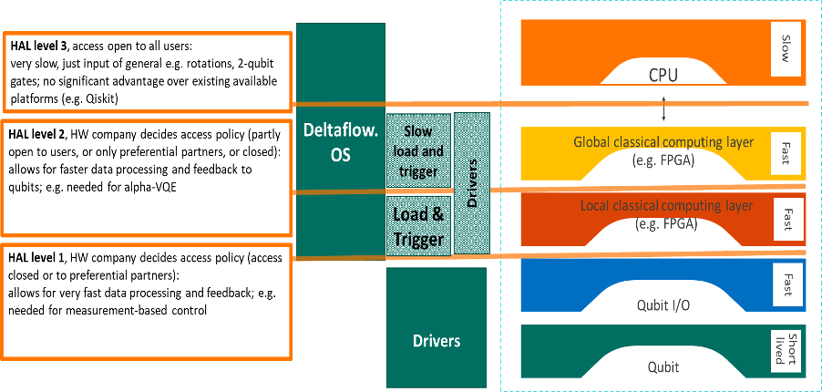

.. title:: general

Introduction
------------

The main purpose of the HAL is to establish a unified northbound API based 
framework across different QPU technologies.
The challenges and architectural issues we endeavour to resolve in developing 
the HAL are:

#. Define the position of Multi-level HAL within the system stack (see Figure 1 below)

#. Maximum portability with minimal loss of performance

#. Maximise the range of common features, keeping the optional, HW dependent features at a minimum

#. Support for advanced features such as compiler optimisations, measurement-based control, and error correction

  Positions of Multi-level HAL layers within the QPU system stack[q1]

The HAL APIs considered in this document MAY be divided into the following groups: [q2] 

* General APIs
  These are most common APIs across different interfaces and platforms.

  * Register/De-register APIs
  
  * Discover APIsoHAL/APIs authentication/authorisation
  * HAL versioning

* Technical area specific (QPU System related)

  * Metadata of the system capabilities/properties

  * Required HAL/QPU commandsoOptional HAL/QPU HW specific commands

* Technical area specific (QPU System advanced features related)

  * HAL supported level authentication and authorisation

  * HAL Advanced/Optional features
