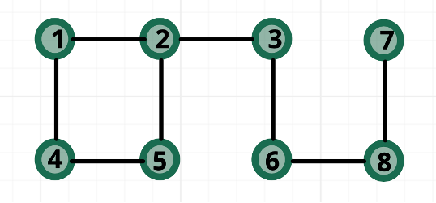

.. title:: metadata

Metadata Format specification
=============================

General
-------

The primary purpose of Metadata is to:

- Allow the Hardware Companies to defend their trade secrets

- Allow the users to identify the hardware platform most suitable for their problems and utilise it at its best
  
- Discourage independent and unverifiable efforts to extract/infer not disclosed information. 
  This prevents hardware companies from being falsely accused of (a) suboptimal service and/or (b) overcharging consumers.

To reach these goals, we believe metadata should be different at the different layers of the HAL. 
Table entries marked as required are described in more details at the bottom of this section.
We will use the definition *valid* to indicate that the circuit, shot, or gate does not infringe 
the information provided by the metadata (e.g. a not valid circuit will use 5 qubits on a 4 qubit system).

Tables should be seen as extensions of the higher levels. E.g. Level2 MUST contain all the fields of Level3. 
Fields of an higher level HAL MAY be converted from OPTIONAL to REQUIRED but not vice-versa.

Level 3 HAL – Application Level
-------------------------------

"Able to run large batches of circuits".

At this level, the final stage compiler (executed by the hardware lab) takes care 
of converting an abstract representation made with universal gatesets, into a native one.

Users are entitled to:

- Fair billing. This will likely entail different cost per time on the quantum machine vs time on the 
  supporting infrastructure.

Users won't appreciate:

- If they send a valid circuit and it gets refused/does not complete in time.

Hardware companies won't appreciate:

- Unfair accusations on performance/correctness/costing that can't be easily disproved 
  and might lead to legal actions.

.. list-table:: Level3 Metadata

  * - Metadata
    - Description
    - Required
    - Notes
  * - **NUM_QBITS**
    - Number of Qubits available
    - Yes
    - It can be lower than the actual number of available qubits.
  * - **MAX_DEPTH** (as universal gates)
    - Maximum depth of the circuit to execute
    - Yes
    - If **NATIVE_GATES** are not provided, this needs to be a conservative value. The conversion from a universal to a native gate set causes not deterministic (but bound) overhead.
  * - **NATIVE_GATES**
    - List of Native Gates
    - No
    - The MAX_DEPTH could be improved significantly by having the definition of native gates here. Effect: Users will benefit from longer circuits.
  * - **GATE_TIMES**
    - The duration of the gates in **NATIVE_GATES**
    - No
    - Without this information, users won't be able to optimise their running costs. With or without the **NATIVE_GATES** information, advanced users can infer this information with sufficient detail as they should be charged on time spent on the quantum machine differently for the time spent on queues.

- **NUM_QUBITS**: 
  
  - Type: UInt64
  
  - Example: 5
  
  - Forbidden Values: [0]
     
- **MAX_DEPTH**:

  - Type: UInt64
  
  - Example: 200
  
  - Forbidden Values: [0]

Level 2 HAL – Shot Level
------------------------

"The results of a single circuit and small batches of circuits can be acted upon."

At this level, the final stage compiler (executed by the hardware lab) takes care of converting 
and mapping a native representation of a circuit and executing it. 
Conversion is performed "on the fly".

Users are entitled to:

- Fair billing. This will likely entail different cost per time on the quantum machine vs time on the supporting infrastructure.

- Guaranteed execution. If they send a valid circuit, it shouldn't get refused as it might be part of a long sequence.
  
Users won't appreciate:

- Unknown QoS – mainly in the context of error rates.

Hardware companies won't appreciate:

- Unfair accusations on performance/costing that can't be easily disproved and might lead to legal actions.

.. list-table:: Level2 Metadata

  * - Metadata
    - Description
    - Required
    - Notes
  * - **NUM_QBITS**
    - Number of Qubits available
    - Yes
    - It can be lower than the actual number of available qubits.
  * - **MAX_DEPTH** (as gates)
    - Maximum depth of the circuit to execute
    - Yes
    - Total number of gates that can be executed. Without the **GATE_TIMES** information the depth will be conservative to allow for additional margin within the coherence time.
  * - **NATIVE_GATES**
    - List of Native Gates
    - Yes
    - It can be a subset of all the available gates
  * - **CONNECTIVITY**
    - The connectivity matrix of the Qubits
    - Yes
    - It is required to support correct compilation of circuits. 
      The hardware company can return different connectivity tables as 
      they deem appropriate (e.g. when a subset of the qubits is exposed 
      they won’t need to expose the full connectivity) every time the 
      Metadata is queried. 
      Connectivity MUST be maintained within two Metadata updates.
  * - **GATE_TIMES**
    - The duration of the gates in **NATIVE_GATES**
    - No
    - Without this information, users won't be able to optimise their running costs. With or without the **NATIVE_GATES** information, advanced users can infer this information with sufficient detail as they should be charged on time spent on the quantum machine differently for the time spent on queues.

- **NATIVE_GATES**: 
  
  - Type: List of parametrisable Matrixes
  
  - Example:
  
  .. code-block::

          [0 1]                   [1 0 0      0      ]
     X =  [1 0]       CR(theta) = [0 1 0      0      ]
                                  [0 0 1      0      ]
                                  [0 0 0 exp(i*theta)]

  - Forbidden Values:
   
    - Any non-canonical form representation
  
    - Null matrix

- **CONNECTIVITY**:
  
  - An adjacency matrix (symmetric) of size N x N (where N is the number of qubits) that represents with a 1 an edge that connects two qubits and with a 0 a not-connected edge 
  
  - Example (refer to Figure 2): 
  
  .. code-block::

                    [0 1 0 1 0 0 0 0]
                    [1 0 1 0 1 0 0 0]
                    [0 1 0 0 0 1 0 0]
                    [1 0 0 0 1 0 0 0]
    CONNECTIVITY =  [0 1 0 1 0 0 0 0]
                    [0 0 1 0 0 0 0 1]
                    [0 0 0 0 0 0 0 1]
                    [0 0 0 0 0 1 1 0]

  - Forbidden Values: Empty matrixes
  
- **ERROR RATE**:
  
  - Error rate is defined as the probability for a quantum operation to introduce an error. 
    A matrix of size N x N (where N is the number of qubits that contains: 
    on the diagonal an average error rate for 1 qubit gate(s); 
    off-diagonal the average error rate of 2 qubits gate(s). 
    To clarify **ERROR_RATE** (1,1) describes the average error rate when 
    executing single qubit gates on qubit0; **ERROR_RATE** (1,2) indicates 
    the average error rate when executing gates two qubit gates on qubit0 
    and qubit1 with (where applicable) 1 being the control qubit and 2 the 
    target one. Multiple matrixes can be returned to define the behaviour of 
    different gates. Optionally the values can be provided as intervals.

- Example:

.. code-block::

                    [0.014 0.02  0     0     0     0     0      0    ]
                    [0.02  0.014 1     0     0     0     0      0    ]
                    [0     0.021 0.013 0     0     0     0      0    ]
                    [0     0     0     0.015 1     0     0      0    ]
    ERROR_RATE =    [0     0     0     0     0.012 0     0      0    ]
                    [0     0     0     0     0     0.016 0      0    ]
                    [0     0     0     0     0     0     0.011  0    ]
                    [0     0     0     0     0     0     0.02   0.012]
    
- Forbidden Values: Empty matrixes and matrixes that violate connectivity. Entries outside the range [0,1].

  Topology used in the example

Level 1 HAL – Gate Level
------------------------

"Results of qubit measurement can be acted upon within a single circuit."

At this level, the final stage compiler (executed by the hardware lab) takes care of converting and mapping a single gate and executing it. 

.. list-table:: Level1 Metadata

  * - Metadata
    - Description
    - Required
    - Notes
  * - **NUM_QBITS**
    - Number of Qubits available
    - Yes
    - It can be lower than the actual number of available qubits.
  * - **MAX_DEPTH** (as gates)
    - Maximum depth of the circuit to execute
    - Yes
    - Total number of gates that can be executed (Heuristic metric). It can be used to force measurements, initializations, early stops.
  * - **NATIVE_GATES**
    - List of Native Gates
    - Yes
    - It can be a subset of all the available gates
  * - **CONNECTIVITY**
    - The connectivity matrix of the Qubits
    - Yes
    - It is required to support correct compilation of circuits. 
  * - **GATE_TIMES**
    - The duration of the gates in **NATIVE_GATES**
    - Yes
    - Shuttling time should be considered as an atomic command of which time execution will be required. This to prevent performance inconsistencies 
  * - **ERROR_RATE**
    - The average error rate for 1Qbit, 2 Qbit operations **NATIVE_GATES**
    - No
    - Without this information the users will have to personally evaluate the performance of the hardware before committing to run intensive applications. 
      Users at this level have all the information required to run randomised benchmarking or similar techniques to extract the metrics.
  
**MAX_DEPTH**:
  
  - Type: uint64 [unit ps]
  
  - Example: 32000000 ps\ \ [32 us]
  
  - Forbidden Values: [0]

**GATE_TIMES**:
    
    - Type: List of uint64 [unit ps]
    
    - Example: X: 16000, Y: 16000, CNOT: 28000
    
    - Forbidden Values: [0]

**ERROR_RATE**: [optional]

  - Type: List of tuples (mean, standard deviation) defined as floating point numbers.
  
  - Example: X: (0.05*10^-3, 0.05*10^-5) , Y: (0.05*10^-3, 0.04*10^-5)
  
  - Forbidden Values: Any usage of NaN (not a number)
  
